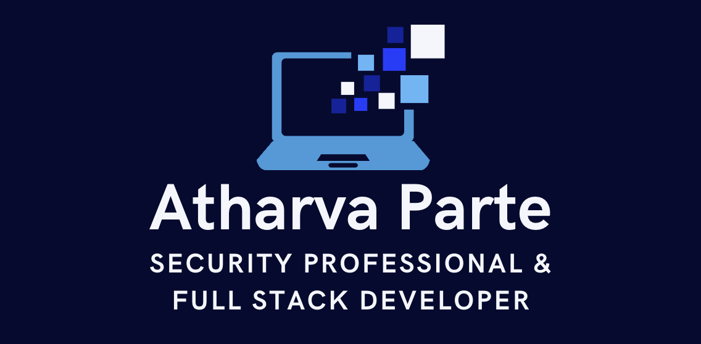
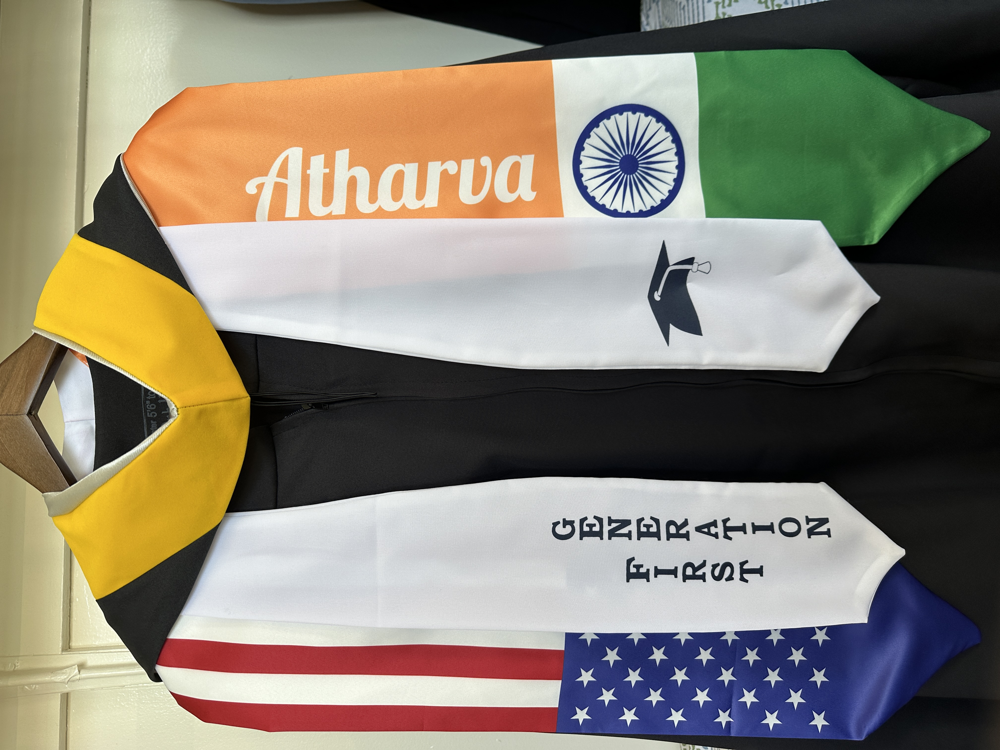

  

  
  
  

 

I'm a passionate developer from India 🇮🇳, currently in the States 🇺🇸. I have a strong focus on information security and full-stack development, specializing in React, React Native, and AWS cloud solutions.

### 🔍 About Me
- 💼 **Software Developer** at [ThriveAI](https://thrivelabs.ai/)
- 📈 **Master of Science in Computer Science** from Stevens Institute of Technology
- 🔒 **Security-focused developer** with expertise in AWS cloud solutions
- 🚀 Passionate about building scalable full-stack applications
- 💡 Strong problem-solver with innovative approaches to complex challenges
- 🌟 Experience with modern frameworks like React, React Native, and Node.js
- ❤️ I love writing secure and efficient code
- 🤝 Open to collaboration on interesting projects
- 💬 Ask me anything [here](https://github.com/atharvaa9/atharvaa9/issues)

### 💼 Experience
#### **Software Developer**
**ThriveAI, USA**  |  **Oct 2024 - Present**
- Developing and maintaining React Native mobile applications with seamless cross-platform functionality
- Implementing real-time chat features and interactive UI components using React.js
- Managing AWS cloud infrastructure and deployments
- Building and optimizing backend services using Node.js
- Implementing user engagement features like quiz systems and interactive chat interfaces

#### **Web Developer / Full Stack Developer**
**Bright Mind Enrichment, USA**  |  **Jul 2024 - Oct 2024**
- Led the design and development of the Bright Mind Wellness Portal using JavaScript, React.js, and Bootstrap, enhancing user engagement through an intuitive interface.
- Architected backend solutions in Node.js with Express.js, ensuring efficient data handling for thousands of monthly users.
- Implemented a secure authentication system using JWT to safeguard user data and privacy.

#### **Graduate Assistant (Web Developer)**
**Stevens Institute of Technology, USA**  |  **May 2023 - May 2024**
- Collaborated with a team to design an interactive room selection platform, enhancing dynamic data visualization across devices.
- Developed real-time communication features using WebSocket and Node.js for instant messaging and video conferencing.

#### **Full Stack Developer**
**KPMG, India**  |  **Jan 2021 - Jul 2022**
- Designed an interactive financial analytics dashboard using React.js and Redux, reducing manual report creation by 30 hours per week.
- Developed backend APIs using Node.js and Express.js to manage complex financial data, ensuring secure data transmission.

#### **Frontend Developer**
**Trigent Software, India**  |  **Jun 2020 - Dec 2020**
- Architected a microservices-based back-end system using Node.js, reducing server response times significantly.
- Spearheaded third-party payment integration with Stripe, processing over 1,000 daily transactions securely.

### 🚀 Project Experience
- **Talent Hunt: A Job Application System**
  - Enhanced user experience and increased job seeker engagement by 40% using React ⚛️.
  - Reduced load times by 50% through Redis, Firebase, and LaTeX integration ⏱️.

- **Airline Reservation System**
  - Built a user-friendly airline reservation website using React.js, Node.js, and MongoDB ✈️.
  - Maintained 99.9% uptime through continuous testing and debugging processes.

- **CineLog: A Movie Logging System**
  - Streamlined user onboarding, increasing engagement by 18% through intuitive design ✨.
  - Developed backend infrastructure for seamless data integration, enhancing accuracy by 40%.

- **Transactly: Secure & Fast Payments**
  - Developed a full-stack digital wallet application using Next.js, Express.js, and PostgreSQL, enabling seamless transactions for over 1,000 simulated users.
  - Integrated Prisma ORM to manage complex database relationships, reducing query execution time by 30%.
  - Designed secure on-ramp transactions with bank web hook handlers to ensure transactional integrity.

### 🔧 Skills & Certifications
- **Programming Languages**: Java, Python, JavaScript, TypeScript
- **Frameworks**: React.js, Node.js, Express.js, Spring Boot
- **Databases**: MongoDB, MySQL, PostgreSQL, Redis
- **Cloud & DevOps**: AWS, GCP, Docker, Kubernetes, CI/CD
- **Certifications**: CEH, CCNA, IIT Kanpur Advanced Program in Cybersecurity, AWS Certified Cloud Practitioner

### 📈 Achievements
- **Improved User Engagement**: Spearheaded projects that significantly increased user satisfaction and engagement metrics.
- **Efficiency**: Reduced development cycles through optimized CI/CD pipelines and Docker deployments.

### 🔗 Connect with Me
- **GitHub**: [atharvaa9](https://github.com/atharvaa9/)
- **LinkedIn**: [atharvaparte](https://www.linkedin.com/in/atharvaparte/)
- **Portfolio**: [Portfolio](https://portfolio-atharva-parte.vercel.app/)
- **Email**: [dev.atharvaparte@gmail.com](mailto:dev.atharvaparte@gmail.com)

### 🌐 Open Source Contributions
- Check out my contributions to various projects on GitHub! I love collaborating and enhancing open-source software.

### 📊 GitHub Stats

### 🛠️ Tools & Technologies
- **Mobile Development**: React Native, iOS, Android
- **Frontend**: React.js, Redux, Bootstrap, Tailwind CSS
- **Backend**: Node.js, Express.js, Spring Boot
- **Cloud**: AWS (extensive experience)
- **Databases**: MongoDB, PostgreSQL
- **DevOps**: Docker, Jenkins, GitLab CI/CD, Terraform

### 🔒 Security Focus
- Implemented comprehensive data security measures, including encryption and secure data protocols, ensuring compliance with international privacy standards.

### 📸 Photo Gallery

  
 
    
    
    
  

  

    
    
    
  

  

    
  

---

  
  
Let's build something amazing together! 💻

  
Feel free to reach out if you have any questions or want to collaborate! Let's build something amazing together! 🚀

